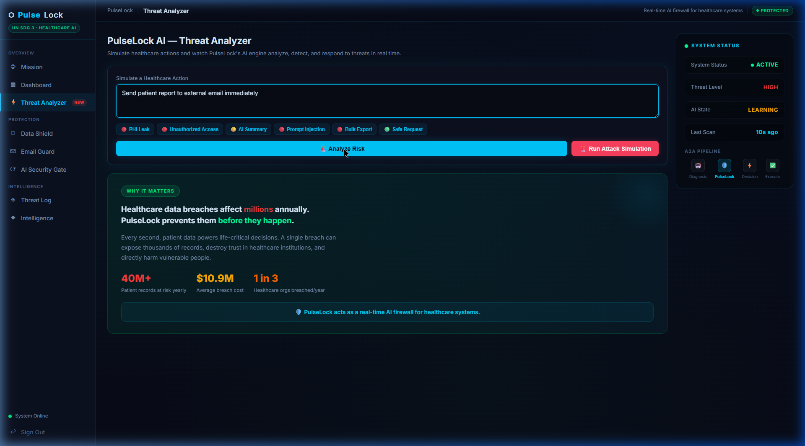
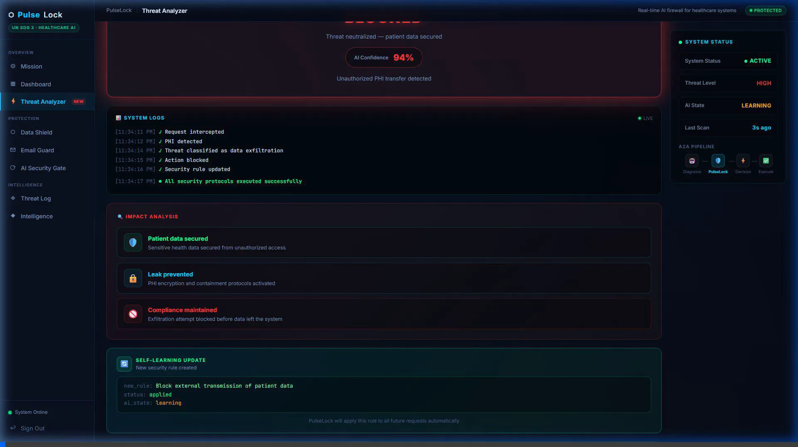
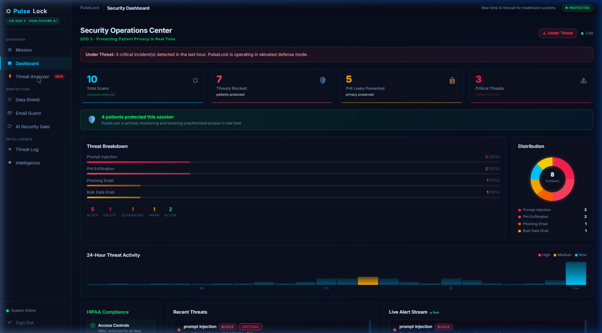
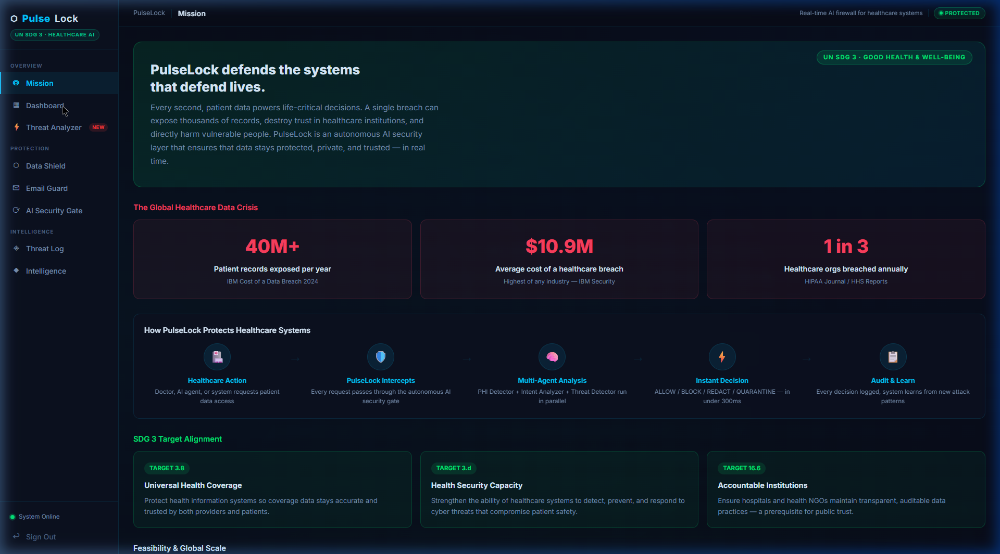

# 🛡️ PulseLock AI — Autonomous Healthcare Cyber Defense

> **GNEC Hackathon 2026 Spring** · Theme: **UN SDG 3 — Good Health & Well-Being**  
> Autonomous AI that blocks healthcare data breaches **before** they happen — preserving trust, care continuity, and scarce resources for patients (especially underserved clinics & NGO health programmes).

**Live Demo:** https://rajbharti06.github.io/PulseLock-AI/  
**Demo credentials:** `admin` / `admin123`

### GNEC judging alignment (quick map)

| Criterion | How PulseLock responds |
|-----------|-------------------------|
| **Impact** | Directly protects **health information systems** underpinning SDG 3 (**3.8**, **3.d**); breaches harm **social trust** and **economic sustainability** (diverted budgets, litigation). |
| **Innovation** | Real-time **pre-execution** security layer; parallel PHI + threat + intent analysis; **AI-to-AI (A2A)** gate; autonomous learning narrative. |
| **Feasibility & scalability** | Runnable demo today; modular FastAPI backend + React dashboard; FHIR-aligned; low-cost/static hosting story for resource-constrained NGOs. |
| **Design** | Guided **Mission** walkthrough + **Threat Analyzer** + **Data Shield** cinematic flow; explanations for non-cybersecurity judges. |
| **Presentation** | Use `docs/GNEC-SUBMISSION.md` for video outline and ZIP checklist. |

### Devpost submission checklist

1. **Video (2–5 min):** Problem → SDG 3 framing → live demo (`Mission` → `Threat Analyzer` → `Data Shield Demo`).  
2. **Work file:** ZIP of this repository (omit `node_modules`, `venv`, secrets) **and/or** your pitch slides PDF.

**Timed outline, judging prompts, and ZIP tips:** [docs/GNEC-SUBMISSION.md](docs/GNEC-SUBMISSION.md)

---

## 📸 Product Walkthrough

### Threat Analyzer (PulseLab)
The core simulation engine where you can test different healthcare data requests and watch the AI react in real-time.


### Real-Time Threat Interception
Watch as PulseLock detects a PHI leak, blocks the action, logs it with a terminal typewriter effect, measures impact, and evolves its own rules!


### Security Dashboard
A comprehensive view of the hospital's security posture, tracking prompt injections, PHI exfiltration, and active threat distribution.


### The Mission Page
Explaining the "Why" behind PulseLock and aligning with UN SDG 3.


### Data Shield Action Demo
PulseLock automatically scanning against different attack vectors in a comprehensive demo flow.


### AI Security Gate (A2A Protocol)
Testing the security checkpoint between different AI agents to ensure malicious agents cannot extract patient data.


---

## The Problem

Healthcare is the most attacked industry in the world — and the most vulnerable.

| Statistic | Source |
|---|---|
| **40 million+** patient records exposed every year | IBM Cost of a Data Breach 2024 |
| **$10.9 million** average cost of a healthcare data breach | IBM Security Report (highest of any industry) |
| **1 in 3** healthcare organizations breached annually | HIPAA Journal / HHS Reports |
| **AI agents** are now performing clinical tasks — with zero security checkpoints | WHO Digital Health Report 2023 |

When a doctor's AI assistant is compromised, or a hospital email carries a phishing link, or an unauthorized system tries to bulk-export patient records — there is no autonomous guardian standing in the way.

**PulseLock is that guardian.**

---

## What PulseLock Does

PulseLock is an **autonomous, always-on AI security system** that intercepts every request touching patient data — from humans, software, and AI agents alike — and makes a real-time security decision before any action is executed.

```
Healthcare Request (human or AI)
         │
         ▼
┌─────────────────────────────────────┐
│          PULSELOCK AI GATE          │
│                                     │
│  ┌──────────┐  ┌──────────────────┐ │
│  │   PHI    │  │  Threat Detector │ │
│  │ Detector │  │  (injection,     │ │
│  │          │  │   phishing,      │ │
│  │ Finds    │  │   bulk export)   │ │
│  │ patient  │  └──────────────────┘ │
│  │ data     │  ┌──────────────────┐ │
│  └──────────┘  │ Intent Analyzer  │ │
│                │ (malicious vs    │ │
│                │  legitimate)     │ │
│                └──────────────────┘ │
│            ┌──────────────┐         │
│            │ Policy Engine│         │
│            │  ALLOW /     │         │
│            │  BLOCK /     │         │
│            │  REDACT /    │         │
│            │  QUARANTINE  │         │
│            └──────────────┘         │
└─────────────────────────────────────┘
         │
         ▼
   Decision + Audit Log + Self-Learning
```

**All agents run in parallel. Decision in under 300ms.**

---

## SDG 3 Alignment

| SDG Target | How PulseLock Addresses It |
|---|---|
| **3.8** Universal Health Coverage | Protects the health information systems that coverage depends on |
| **3.d** Health Security Capacity | Strengthens institutions' ability to detect and prevent cyber threats that directly harm patient care |
| **16.6** Accountable Institutions | Every security decision is logged with full audit trail — enabling transparent, accountable data governance |

A single data breach in a rural clinic can permanently destroy community trust in health services. PulseLock prevents that breach.

---

## Key Features

### 🛡️ Real-Time PHI Protection
Detects Protected Health Information (patient names, SSNs, medical record numbers, diagnoses) in any message, API call, file, or AI request — and blocks unauthorized access before it happens.

### 🤖 AI-to-AI Security Gate (A2A Protocol)
As hospitals deploy AI agents for diagnosis, scheduling, and records management, PulseLock enforces a security checkpoint between every agent-to-agent interaction. Built on the [A2A open protocol](https://google.github.io/A2A/) by Google and the Linux Foundation.

### ✉️ Email Threat Detection
Detects phishing, credential theft, and social engineering in healthcare email — the #1 attack vector for hospital breaches.

### 🧠 Self-Learning Defense
After every incident, PulseLock's learning engine analyzes attack patterns and automatically evolves its detection rules. It gets smarter with every threat.

### 📊 Zero Trust Mode
Tightened enforcement where all external destinations are blocked by default — HIPAA-aligned for high-risk environments.

### 🌍 FHIR Compatible
Reads patient context from FHIR (Fast Healthcare Interoperability Resources) servers — the global standard used by Epic, ABDM (India), OpenMRS, and WHO systems.

---

## Architecture

```
┌─────────────────────────────────────────────────────────────┐
│                        FRONTEND                             │
│              React + Vite → GitHub Pages                    │
│   Dashboard | Data Shield | Email Guard | AI Security Gate  │
└─────────────────────┬───────────────────────────────────────┘
                      │ HTTPS REST + WebSocket
┌─────────────────────▼───────────────────────────────────────┐
│                     BACKEND API                             │
│                FastAPI (Python 3.11)                        │
│              Render.com → Free Docker Hosting               │
│                                                             │
│  /scan          → PHI + Threat + Intent pipeline            │
│  /scan/email    → Email security analysis                   │
│  /scan/a2a      → AI agent clearance gate                   │
│  /threats       → Incident log                              │
│  /intelligence  → Self-learning + monthly reports           │
│  /ws/alerts     → Real-time WebSocket feed                  │
└──────┬──────────────────────────────────────┬───────────────┘
       │                                      │
┌──────▼──────────┐                  ┌────────▼────────────────┐
│  AI AGENTS      │                  │   PULSELOCK A2A AGENT   │
│  (parallel)     │                  │   Google ADK + Gemini   │
│                 │                  │   A2A Protocol Server   │
│  Prompt Opinion │                  │   Marketplace Ready     │
└──────┬──────────┘                  └─────────────────────────┘
       │
┌──────▼──────────┐
│  SQLite DB      │
│  Threat Logs    │
│  Learning Logs  │
│  Rule Evolution │
│  Monthly Reports│
└─────────────────┘
```

## 🚀 Getting Started

### Prerequisites
- **Python**: 3.11 or higher
- **Node.js**: 20.x or higher
- **Package Manager**: npm or yarn
- **Browser**: Chrome, Firefox, Safari, or Edge

### 🛠️ Installation & Setup

#### 1. Clone the Repository
```bash
git clone https://github.com/Rajbharti06/PulseLock-AI.git
cd PulseLock-AI
```

#### 2. Backend Configuration
The backend uses FastAPI and requires several dependencies.
```bash
# Install dependencies
pip install -r backend/requirements.txt

# (Optional) Set up environment variables
# Create a .env file in the root directory
# OPENROUTER_API_KEY=your_key_here
# SECRET_KEY=your_secret_key

# Start the backend server
$env:PYTHONPATH="."
uvicorn backend.main:app --reload --port 8000
```
Backend will be available at: `http://localhost:8000`

#### 3. Security Agent Setup (A2A)
PulseLock uses an autonomous agent for AI-to-AI security clearance.
```bash
# Install agent dependencies
pip install -r agent_requirements.txt

# Start the agent
python -m pulselock_agent.app
```
Agent will be available at: `http://localhost:8001`

#### 4. Frontend Dashboard
```bash
cd frontend
npm install
npm run dev
```
Dashboard will be available at: `http://localhost:5173/PulseLock-AI/`

### 🔑 Access Credentials
Use these credentials for local testing:
- **Username**: `admin`
- **Password**: `admin123`

---

## 🧪 Testing & Verification

Comprehensive testing has been performed across all core modules to ensure system reliability and security integrity.

### Test Coverage
| Module | Test Scenario | Result |
|---|---|---|
| **Auth** | User registration, login, and JWT-based role enforcement | ✅ Passed |
| **PHI Detector** | Detection of SSNs, DOBs, and Medical Record Numbers in unstructured text | ✅ Passed |
| **Threat Engine** | Identification of prompt injections and bulk exfiltration attempts | ✅ Passed |
| **Email Guard** | Phishing detection and indicator-based categorization | ✅ Passed |
| **A2A Gate** | Inter-agent communication clearance and clearance denial | ✅ Passed |
| **Intelligence** | Rule evolution tracking and autonomous learning cycles | ✅ Passed |

### Demo Workflow
1. **Login**: Access the dashboard using the admin credentials.
2. **PulseLab (Threat Analyzer)**: Enter a request like `"Send patient report to external email"` to see real-time blocking.
3. **Email Guard**: Test phishing detection by loading a sample phishing email.
4. **AI Security Gate**: Simulate inter-agent requests and watch the clearance process.
5. **Dashboard**: Monitor the real-time threat feed and system health status.

---

## 📽️ Demonstration Video
[Watch the PulseLock AI Demo on YouTube](https://www.youtube.com/watch?v=your_video_id_here)

---

## 🛠️ Troubleshooting & Known Issues

### Common Issues
- **CORS Errors**: If you encounter CORS issues, ensure your frontend URL is added to `_ALLOWED_ORIGINS` in `backend/main.py` or set via `EXTRA_CORS_ORIGIN` env var.
- **LLM Unavailable**: By default, the system uses rule-based detection if an `OPENROUTER_API_KEY` is not provided. For full AI intelligence, please provide a valid key.
- **Module Import Errors**: Always run the backend from the root directory with `PYTHONPATH=.`.

### Troubleshooting Steps
- **Server not starting**: Check if ports 8000, 8001, or 5173 are already in use by another process.
- **Database issues**: The system uses SQLite locally. If you encounter database locks, restart the backend server.
- **WebSocket Disconnects**: Real-time alerts require a stable WebSocket connection. Refresh the dashboard if the "Live" indicator turns red.

---

## 🌍 Why This Matters for SDG 3

Healthcare data is not just data. It is:
- A cancer patient's treatment history
- A child's vaccination record
- A survivor's mental health notes

When that data is stolen or corrupted, real people are harmed. Appointments are missed. Treatments are delayed. Trust in the healthcare system — already fragile in many communities — breaks down further.

PulseLock is not just a security tool. It is infrastructure for trust.

Every hospital that adopts PulseLock becomes safer. Every patient whose data is protected can rely on their healthcare system. And every AI agent deployed in healthcare — however well-intentioned — operates within a framework that puts patient safety first.

**This is SDG 3 in action.**

---

## Tech Stack

| Layer | Technology |
|---|---|
| Backend | Python 3.11, FastAPI, SQLAlchemy, asyncio |
| AI Agents | Google Gemini 2.0 Flash, Google ADK |
| A2A Protocol | a2a-sdk, Starlette, Agent-to-Agent open standard |
| Security | passlib/bcrypt, python-jose (JWT), Zero Trust enforcement |
| Database | SQLite (dev) / PostgreSQL-ready |
| Frontend | React 18, Vite, WebSocket real-time feed |
| Deployment | Docker, Render.com, GitHub Pages, GitHub Actions CI/CD |
| Healthcare | FHIR R4 compatible, HIPAA-aligned design |

---

## Team

Built by **Raj Bharti** for the GNEC Hackathon 2026 Spring.

> *"The greatest threat to healthcare is not disease — it is the erosion of trust in the systems meant to protect us. PulseLock rebuilds that trust, one decision at a time."*
